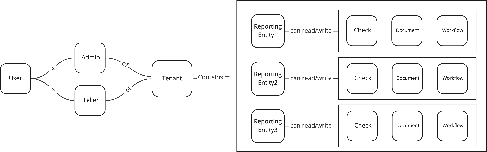

# Access Control

## Concepts

### Business Unit Hierarchy

The primary organising principle for platform resources and data is an AML Reporting Entity.  For billing purposes, a Reporting Entity belongs to a single account (tenant), with more than one Reporting Entity being able to belong to the same account.&#x20;

For example, Ray White New Zealand has a single Amlify account with each branch being a separate AML Reporting Entity.

### Role-based Access

The platform uses roles to determine a user's access to resources. A role can specify _read_ or _write_ access for a resource. If not specified, the default is to _deny_ resource access.

Roles are established and provisioned at the Reporting Entity level. That is, each Reporting Entity will use roles to determine access to its resources.&#x20;

### Reporting Entity Access

User access to a reporting entity (and thereby, a tenant) is mediated by the role they have been assigned within the Reporting Entity. No role equates to no access.

Users can be associated with multiple tenants simply by being assigned to a role within a Reporting Entity.

### Tenant 'Switching' (??)

Is there any need for this?

## Access Scenarios

The solution would handle following scenarios:

1. If I am an admin/teller of a reporting entity, I should be able to write/read the resources of that reporting entity.&#x20;
2. If I am an admin/teller of a tenant, I should be able to write/read the resources of all the reporting entities of that tenant.&#x20;

Solution:

1. We use auth service to store the accessible reporting entities for a user (add a new property in the collection: user).
2. We use Ory Keto relationship to specify the relationship and access rules. A sample relationship could be found in [https://github.com/ticctech/auth/blob/main/.keto/multi-reportingEntity.namespace.keto.ts](https://github.com/ticctech/auth/blob/main/.keto/multi-reportingEntity.namespace.keto.ts).
3. Every request from portal to the service will contain a header of request reporting entity id. The interceptor in grpcsdk will call Keto API to verify if user has access to the resource of the report entity or not.

<figure><figcaption></figcaption></figure>

## Implementation

Here are change list for the proposed solution:

1. auth service:
   1. create or update users, there is a function called addToRole in user.go. Need to update this function to add the roles for users.
   2. create or update user, set the accessible reporting entity in user collection.
2. reportingentity service:
   1. Create reporting entity, update Ory relationship to set the tenant as the parent of reporting entity.
   2. Create reporting entity, update Ory relationship to set the resource of a reporting entity, such as reportingentity123/check, reportingentity123/policy.
3. grpcsdk:
   1. authz.go: update interceptor to check permissions from Ory.&#x20;
4. portal:
   1. update portal to show accessible reporting entity.
   2. include reporting entity id in requests to backend.
5. Migrate existing data:
   1. Add reporting entity to existing mongodb data.
   2. Migrate existing Org relationships.&#x20;
6. Update postman request with reporting entity id.

