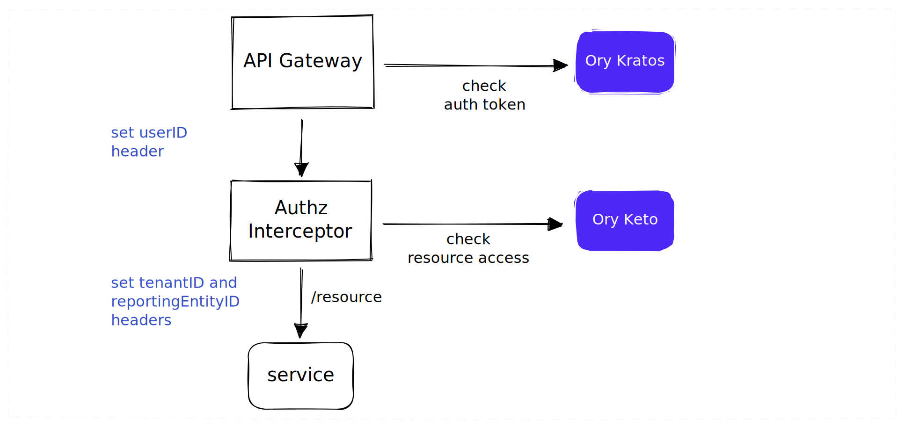

# Access Control

## Concepts

### Business Unit Hierarchy

The primary organising principle for platform resources and data is an AML Reporting Entity.  For billing purposes, a Reporting Entity belongs to a single account (tenant), with more than one Reporting Entity being able to belong to the same account.&#x20;


For example, Ray White New Zealand has a single Amlify account with each branch being a separate AML Reporting Entity.

### Role-based Access

The platform uses roles to determine a user's access to resources. A role can specify _read_ or _write_ access for a resource. If not specified, the default is to _deny_ resource access.


Roles are established and provisioned at the Reporting Entity level. That is, each Reporting Entity will use roles to determine access to its resources.&#x20;

### Reporting Entity Access

User access to a reporting entity (and thereby, a tenant) is mediated by the role they have been assigned within the Reporting Entity. No role equates to no access.


Users can be associated with multiple tenants simply by being assigned to a role within a Reporting Entity.

### Tenant 'Switching' (??)

Is there any need for this?

## Access Scenarios

The solution would handle following scenarios:

1. As **admin** of a reporting entity, I should be able to create, edit, and delete resources of the reporting entity.
2. As **teller** of a reporting entity, I should be able to read, create, edit, and delete selected resources of the reporting entity.&#x20;

## Implementation

Key components involved in controlling access to resources.



### API Manager

API manager configuration required to translate identity information to headers needed to support access control in subsequent layers...


Need a way to resolve tenantID for Reporting Entity. Should we cache or query MongoDB?


### Keto Permissions

Keto relationship tuples required to support scenarios above...

```typescript
import { Namespace, SubjectSet, Context } from "@ory/permission-namespace-types"

//This is the keto namespace for relationships defined to handle tenant and multiple reproting entity senarios.

class User implements Namespace { }

// Role could be admin or teller
class Role implements Namespace {
  related: {
    member: User[]
  }
}

// Resource Group could be reporting entity, which has parent of tenant. Or tenant
class ResourceGroup implements Namespace {
  related: {
    parent: ResourceGroup[]
    reader: SubjectSet<Role, "member">[]
    writer: SubjectSet<Role, "member">[]
  }

  permits = {
    read: (ctx: Context): boolean =>
      this.related.reader.includes(ctx.subject) ||
      this.related.writer.includes(ctx.subject) ||
      this.related.parent.traverse(p => p.permits.read(ctx)),

    write: (ctx: Context) =>
      this.related.writer.includes(ctx.subject) ||
      this.related.parent.traverse(p => p.permits.write(ctx)),
  }
}

class Resource implements Namespace {
  related: {
    parent: ResourceGroup[]
  }

  permits = {
    read: (ctx: Context): boolean =>
      this.related.parent.traverse(p => p.permits.read(ctx)),
    write: (ctx: Context): boolean =>
      this.related.parent.traverse(p => p.permits.write(ctx))
  }
}
```

### Data Access

MongoDB data storage and retrieval...

```json
{
  "tenantId": "bee0de62-cc2e-4686-94da-0e4d4c956188",
  "reportingEntityId": "44cbb6d7-8155-48bf-970c-efb6600e8e07",
  "updatedBy": "30b0c1bf-0f5f-442d-ab0b-f8c820837ae3",
  "updatedAt": {
    "$date": {
      "$numberLong": "1672356186008"
    }
  },
  "<proto message>": {
    ...
  }
}
```
