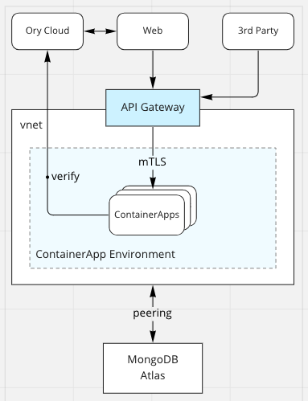

# Microgateways

A service mesh supports a more decentralised API and, by extension, API gateways. Because, with service mesh support, each service can expose and control access to its own API, there is no need for centralised API management.

<!--  -->

The team responsible for a service controls what APIs to expose, authentication, access, and even which protocols they want to support.

## gRPC and REST

By default, each service is a gRPC server. They expose external interfaces and communicate using gRPC and Protocol Buffers. However, simply by annotating the protobuf service definitions, any service can also expose a "legacy" RESTful API with gRPC to HTTP/JSON transcoding handled automatically.

## External authorisation

By default, the mesh is configured to validate JWT tokens issued to frontend users. However, Istio also supports an external authorisation API that services can use to validate custom API tokens and authorise access.

The`subscription`service employs this method to validate Stripe webhook calls.

## Developer portal

Each service can automatically generate its own OpenAPI documentation from the Protocol Buffers specification. The developer portal is simply a collection of OpenAPI documents published using GitBook.
